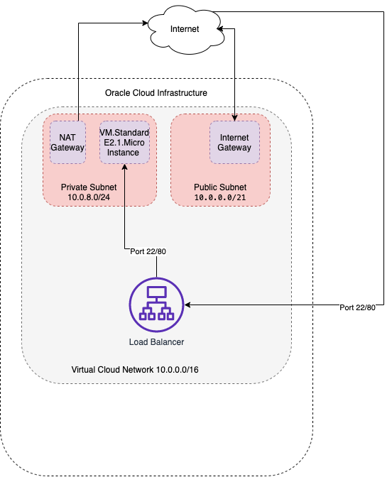

### OCI load balancer in front of a private instance with terraform
    
This solution creates a load balancer, a public subnet with an Internet Gateway attached, a private subnet with a NAT Gateway attached and an instance assigned to the private subnet.  
     
Using the load balancer listeners for 22 and 80 ports, we are able to SSH into the private instance and display the default httpd page.

### Requirements
* OCI-CLI (https://docs.oracle.com/en-us/iaas/Content/API/SDKDocs/cliinstall.htm)
* Terraform CLI (https://learn.hashicorp.com/tutorials/terraform/install-cli?in=terraform/oci-get-started)

### Steps
* oci session authenticate
* terraform apply

This solution uses oci session authenticate method. With little changes, the provider can be hydrated with extra parameters to avoid oci session authenticate.

